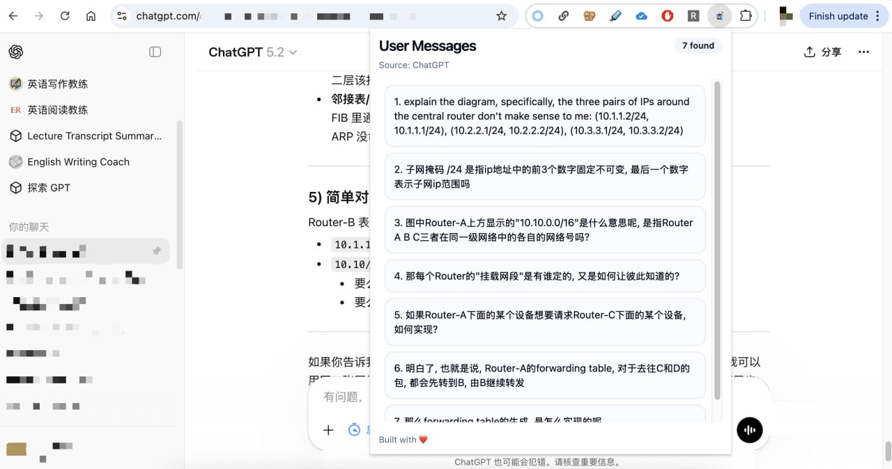
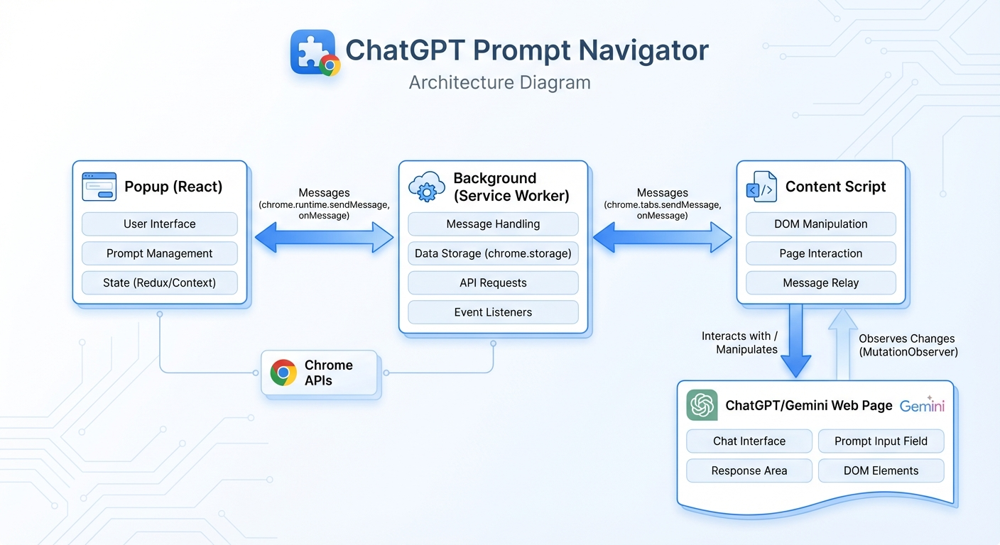
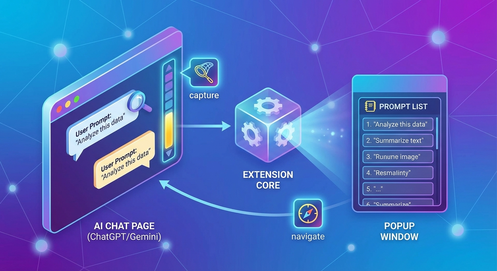

# ChatGPT Prompt Navigator (React + TypeScript + Vite)

A modern Chrome extension built with React and Tailwind CSS that helps you navigate your AI conversations by capturing prompts and allowing quick scrolling back to them.

## 🚀 Overview

**ChatGPT Prompt Navigator** is designed to enhance your workflow when using AI chat interfaces like ChatGPT and Gemini. It automatically extracts your prompts from the current page and provides a clean, searchable list in the extension popup. Click any prompt to smoothly scroll the page back to its original location.

### ✨ Features

- **Auto-Capture**: Instantly detects and lists all user prompts on the page.
- **Quick Navigation**: One-click scrolling to find specific messages in long conversations.
- **Provider Support**: Works seamlessly with:
  - `chatgpt.com` / `chat.openai.com`
  - `gemini.google.com`
- **Modern UI**: Built with React, Tailwind CSS, and Radix UI components for a polished feel.
- **Development Mode**: Includes mock data support for testing without a browser extension environment.

## 🛠️ Architecture

The project follows the standard Chrome Extension Manifest V3 architecture with a modern build pipeline:

- **Popup (React)**: The main user interface for listing and interacting with prompts.
- **Background (Service Worker)**: Orchestrates message passing between the popup and the active tab.
- **Content Scripts**: Injected scripts that interact with the AI provider's DOM to extract content and perform navigation.
- **Provider Adapters**: A flexible system to support multiple AI chat platforms with custom selectors and matching logic.

## 🏗️ Technical Stack

- **Framework**: [React 19](https://react.dev/)
- **Build Tool**: [Vite](https://vitejs.dev/)
- **Styling**: [Tailwind CSS](https://tailwindcss.com/)
- **Language**: [TypeScript](https://www.typescriptlang.org/)
- **Icons**: [Lucide React](https://lucide.dev/)
- **Components**: [Radix UI](https://www.radix-ui.com/)

## 📦 Getting Started

### Prerequisites

- [Node.js](https://nodejs.org/) (latest LTS recommended)
- [npm](https://www.npmjs.com/) or [pnpm](https://pnpm.io/)

### Installation

1. Clone the repository:
   ```bash
   git clone https://github.com/your-username/chatgpt-extension-react.git
   cd chatgpt-extension-react
   ```

2. Install dependencies:
   ```bash
   npm install
   ```

### Development

Run the development server for UI work (mock data enabled):
```bash
npm run dev
```

### Build

To build the extension for production:
```bash
npm run build
```
The output files will be in the `dist` directory (organized by `popup`, `background`, and `content-script`).

### Loading in Chrome

1. Open Chrome and navigate to `chrome://extensions/`.
2. Enable "Developer mode" (toggle in the top right).
3. Click "Load unpacked".
4. Select the `dist` folder generated by the build.

## 📸 Screenshots



## 🗺️ Visual Guides

### Architectural Diagram


### Conceptual Birdview


## 📄 License

MIT
